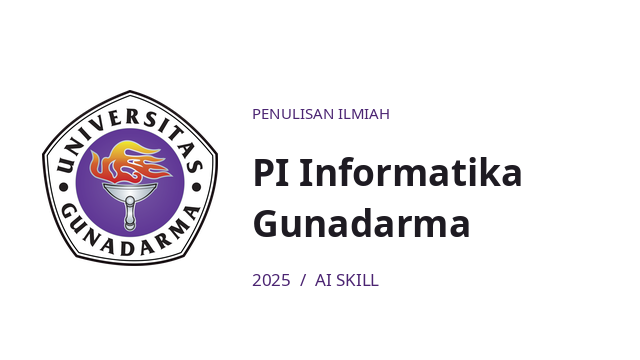

# Skill PI Informatika Gunadarma




AI coding agent skill for writing, structuring, and auditing Scientific Papers (Penulisan Ilmiah / PI) for Informatics at Gunadarma University, based on the official 2025 guidelines. Compatible with Claude Code, OpenAI Codex, and Hermes Agent.

Read the full rule specification in [`SKILL.md`](SKILL.md).

## Workflow Architecture

```text
+-------------------------------------------------------------+
| Scientific Manuscript (Draft DOCX / LyX / Rendered PDF)     |
+------------------------------|------------------------------+
                               |
                               v
+-------------------------------------------------------------+
| Gunadarma PI 2025 Skill Engine                              |
|                                                             |
|  [Document Structure] : Margin, typography, page indexing   |
|  [State of the Art]   : Literature matrix and gap analysis  |
|  [Visuals & Code]     : Monochrome charts, code appendix    |
|  [Conflict Engine]    : 18 guideline conflict overrides     |
|  [Administrative]     : Defense preparation and ACC checks  |
+------------------------------|------------------------------+
                               |
                               v
+-------------------------------------------------------------+
| Structured Evidence-Led Audit Report                        |
|   - Status: sesuai / tidak sesuai / belum diuji / ambigu    |
|   - Evidence: Exact line, guideline page, and action item   |
+-------------------------------------------------------------+
```

## Mulai di sini

Siapkan naskah PI versi terakhir. Untuk audit isi dan format yang lengkap, sertakan file sumber (misalnya DOCX atau LyX/LaTeX), PDF hasil render, dan PDF pedoman resmi. Kalau hanya ada teks, agent bisa memeriksa isi, tetapi tidak boleh memastikan margin, font, posisi caption, atau nomor halaman. Untuk sidang/pengumpulan, sertakan juga catatan revisi atau instruksi prodi terbaru bila ada. Jangan kirim identitas pribadi yang tidak diperlukan.

1. Pasang skill lewat petunjuk di bawah, lalu mulai sesi agent baru.
2. Berikan berkas yang tersedia dan pilih salah satu contoh permintaan.
3. Periksa laporan: tiap temuan harus punya lokasi di naskah, halaman pedoman, status, dan tindakan. Lihat [contoh laporan fiktif](examples/contoh-audit.md).

## Pasang skill

Salin `SKILL.md` bersama seluruh `references/`. Pilih satu target direktori sesuai agent yang kamu pakai:

```sh
git clone git@github.com:azrahudaya/skill-pi-informatika-gunadarma.git
cd skill-pi-informatika-gunadarma
SKILL=pedoman-pi-informatika-gunadarma-2025

# Claude Code
DEST="$HOME/.claude/skills/$SKILL"

# OpenAI Codex
# DEST="$HOME/.agents/skills/$SKILL"

# Hermes Agent
# DEST="$HOME/.hermes/skills/productivity/$SKILL"

mkdir -p "$DEST/references"
cp SKILL.md "$DEST/"
cp -R references/. "$DEST/references/"
```

Mulai sesi baru agar agent mengenali skill. PDF pedoman resmi universitas tidak disertakan di dalam repository ini. Berikan file PDF resmi secara mandiri jika memerlukan audit kutipan dan tata letak yang presisi.

## Contoh permintaan

- **audit format:** "Pakai skill pedoman-pi-informatika-gunadarma-2025 untuk audit format dan isi naskah PI ini. Ini DOCX, PDF hasil render, dan PDF pedoman 2025. Buat matriks aturan, status, bukti lokasi naskah, halaman pedoman, dan tindakan. Tandai yang belum bisa diuji."
- **kerangka PI:** "Bantu buat kerangka PI Informatika untuk topik [topik] berdasarkan pedoman 2025. Pisahkan aturan wajib dari contoh, dan jangan buat hasil penelitian atau sumber pustaka fiktif."
- **sidang:** "Cek kesiapan sidang PI saya berdasarkan berkas yang saya berikan. Bedakan syarat pedoman 2025 dari prosedur administrasi yang harus dicek ulang ke kanal resmi. Jangan mengirim berkas."
- **Penelitian terdahulu:** "Buat tabel perbandingan seperti contoh PI Nicky, tetapi verifikasi tiap metode dan hasil dari artikel asli. Bedakan dataset, protokol evaluasi, temuan, dan gap penelitian saya. Tandai artikel yang teks lengkapnya belum dibaca."
- **Grafik dan kode:** "Pilih visual hanya untuk hasil yang memang perlu diperjelas. Gunakan angka asli, hitam putih yang terbaca saat dicetak, caption dan daftar gambar yang tepat. Masukkan seluruh kode penelitian yang dipakai ke lampiran, lalu cocokkan PDF dan DOCX dengan berkas sumber serta hasil eksekusi."

Saat membuat draf naskah lengkap, pakai [panduan inden dan placeholder](references/draf-dokumen.md): paragraf isi menjorok 1,25 cm sebagai pilihan format draf, sedangkan data yang belum diketahui memakai `(.....................)` dengan stabilo kuning. Angka inden itu bukan ketentuan eksplisit pedoman. Untuk tabel literatur pakai [panduan penelitian terdahulu](references/penelitian-terdahulu.md). Untuk grafik, diagram dan listing program pakai [panduan visual dan lampiran kode](references/visual-dan-lampiran-kode.md). Keduanya membedakan kewajiban pedoman dari pilihan penyajian.

Hasil audit memakai status `sesuai`, `tidak sesuai`, `belum dapat diuji`, atau `pedoman ambigu`. [Alur audit](references/alur-audit.md) menjelaskan arti status dan bukti yang diperlukan. [Daftar konflik pedoman](references/ketidakselarasan.md) mencegah contoh lampiran dibaca sebagai aturan baru. Contoh keluaran bukan sertifikat kelulusan PI.

## Pemeriksaan paket

```sh
python3 scripts/validate.py
python3 -m unittest discover -s tests -v
```

Pemeriksaan ini menguji kelengkapan paket dan kontrak dokumentasi, bukan menjamin agent mengaudit naskah secara benar. [Skenario uji perilaku agent](tests/skenario-agent.md) tersedia untuk pengujian manual. Audit nyata tetap memerlukan naskah, sumber, render visual, dan pemeriksaan manusia.

## Hak penggunaan

Azra Hudaya belum menetapkan lisensi penggunaan ulang untuk teks skill ini (`license: Proprietary`). Ketersediaan repo secara publik dan petunjuk pemasangan bukan pernyataan izin untuk memakai ulang, memodifikasi, atau mendistribusikan teks skill. Hubungi pemilik untuk meminta izin atau menanyakan ketentuannya. PDF pedoman universitas tidak disertakan dan tidak dilisensikan ulang di sini. Periksa prosedur pengumpulan terbaru di kanal resmi prodi sebelum menyerahkan data atau berkas.

Dibuat oleh [Azra Hudaya](https://github.com/azrahudaya).
